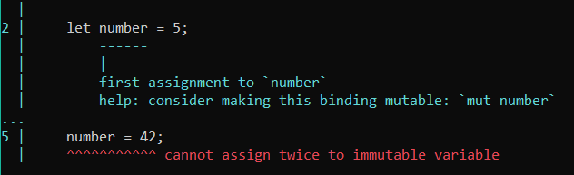

# Rust programming language

## Introduction

It is the tutorial to start with the perspective programming language Rust. After this tutorial you will be able to understand the basic syntax of Rust, write and run your own programs.

### What is rust?

Rust is an open-source systems programming language that focuses on speed, memory safety and parallelism.

### Use cases

Rust has a plenty of use cases. It could be used like everywhere. The following examples is showing this:
- smart-contracts
- web-servers
- compilers
- game engines
- interpreteres
- virtual machines
- mail servers 
- databases
- operating systems
- web browsers

### Why is it useful?

It is useful for the developers, because it has the same speed as the low-level languages such as C or C++ and it has some features from the high-level languages, which makes it more comfortable to work with.

## Setting up the environment

download the rustup-init.exe file from https://www.rust-lang.org/learn/get-started

## First program

The tutorial starts with creating a simple program, which outputs hello world to the console.

Open console in the folder, where you want to create new folder with your project and write the following command to the console:

```text
cargo new hello-world
```
> ##### @icon-question Command meaning 
>This command creates new Rust project, named hello-world with the main file (hello-world/src/main.rs), where program, which outputs hello world to the console is written.

Next command is :

```text
cargo run
```

> ##### @icon-question Command meaning 
> This command runs Rust project, it doesn't matter, will you run the script from the project directory or from the /src directory, both options are available.

## Including dependencies

Lets firstly create a new project named hello-rust

```text
cargo new hello-rust
```

This part will show, how to include the dependencies into the project. The project contains file Cargo.toml, which holds information about the project. The dependencies should be added below [dependencies] in the following way:


After the Cargo.toml file was changed, the main code could be rewritten. By now, just paste the code below into the src/main.rs

```rust
use ferris_says::say;
use std::io::{stdout, BufWriter};

fn main() {
    let stdout = stdout();
    let message = String::from("Hello fellow Rustaceans!");
    let width = message.chars().count();

    let mut writer = BufWriter::new(stdout.lock());
    say(message.as_bytes(), width, &mut writer).unwrap();
}
```

the output should be :


---
Now, after you know, how to create new project, add dependencies in it and run the source files, lets start with the main part of the tutorial.

```text
The project is in code/hello-rust directory
```

## Variables and data types

### Variables

Variables in rust language are created by the key word ```let```. Lets try to create one by ourselves:
```rust
fn main(){
    let number = 5;
    println!("The variable is {}", number);
}
```

> ##### @icon-code Printing the value
> For showing the value in the console, ```println!``` is used. It takes a string with square brackets in it, they are placeholders for the variables or values, passed after the string, separated by comma. For example, ```println!("{} + {} is {}", 1, 2, 3)```, will output 1 + 2 is 3.

Now lets try to assign different value to variable number, for example 42.

```rust
fn main() {
    let number = 5;
    println!("The variable is {}", number);

    number = 42;
    println!("The variable is {}", number);
}
```

After running the project, compiler says that there is an error. Specifically, it is impossible to assign the value to the same variable twice, because, in Rust variables are **immutable** by default.

> @icon-book Note: immutable means the same as unchangeable

Here is the output message, from the compiler, which says that it is impossible to assign twice:



There are 2 options of fixing this error:
* using ```mut``` keyword before the variable name:
```rust
let mut number = 5;
```
* using ```shadowing```

> @icon-book Note: shadowing in Rust means assigning a value to the variable with the same name. Because of this, the program sees the last value of the variable.

```rust
let number = 5;
let number = 42;
```

Also, very interesting thing about shadowing is that if the new value is assigned in the new scope, the value will go back to its previous value after returning from that scope:

```rust
let number = 5;
{
    let number = number * 2;
}
```

Inside the scope its value will be 10, but after, it will be equal to 5 again.

```text
The code is in the code/variables/src/main.rs file
```

### Constants

In Rust, besides mutable and immutable variables, there are constants. You have probably asked yourself, what is the difference between immutable variables and constants, they are both immutable.

The thing is that ```constants are always immutable```. That means that it couldn't be reassigned using shadowing. In addition, ```constants must have values that don't change during the program execution. Moreover, constants must have their type defined.``` 

For instance, you want to have a constant for the amount of hours in a week, in this case, you should use constant:

```rust
const HOURS_PER_WEEK: u32 = 24 * 7;
```
> ##### @icon-code Code explanation
> ```'const'``` is the key word for defining the constant; ```'HOURS_PER_WEEK'``` is the name of the variable; ```'u32'``` is the data type, which is ***32-bit unsigned int***; ```'24*7'``` is its value

However, if we want to have immutable variable for the amount of hours that is in some amount of weeks, which is entered by the user, it won't be possible, because the program cannot derive the value before the run.

```text
The code is in the code/variables/src/main.rs file
```

### Data types

Rust is statically typed language, which means that the program must know the types of all the variables at compile time. Most of the time, compiler is able to derive the type from the value. However, sometimes many types are possible. In this cases, you must add the type annotation, like this:

```rust
fn main() {
    let number: u32 = "142".parse().expect("Not a number");
    println!("{}", number - 100 );
}
```

> ##### @icon-code Code Explanation
> Variable ```number``` is assigned to the value of type ```u32```. The value is string, parsed to u32. ```expect``` is used for catching the error, when the string is not a number.

If the data type won`t be specified, then the following error will be displayed:


The data types in Rust are split into 2 groups: 
* **Scalar types**
  - integer 
  - float
  - character
  - boolean
* **Compound types**
  - array
  - tuple
  
```text
The code is in the code/data_types/src/main.rs file
```

#### Scalar Types

> ##### @icon-book Definition
> Scalar type is the type that represents a single value.

##### Integer Types

+---------+--------+----------+
| Length  | Signed | Unsigned |
+=========+========+==========+
| 8-bit   | i8     | u8       |
+---------+--------+----------+
| 16-bit  | i16    | u16      |
+---------+--------+----------+
| 32-bit  | i32    | u32      |
+---------+--------+----------+
| 64-bit  | i64    | u64      |
+---------+--------+----------+
| 128-bit | i128   | u128     |
+---------+--------+----------+
| arch    | isize  | usize    |
+---------+--------+----------+

+-----------------+-------------+
| Number literals | Example     |
+=================+=============+
| Decimal         | 999_999     |
+-----------------+-------------+
| Hex             | 0xFF        |
+-----------------+-------------+
| Octal           | 0o77        |
+-----------------+-------------+
| Binary          | 0b0101_0101 |
+-----------------+-------------+
| Byte(u8 only)   | b'A'        |
+-----------------+-------------+

> Note @icon-code: 999_999 is the same as 999999, but more readable

##### Floating-point Types
 Rust has 2 types for floating-point numbers: ```f32``` and ```f64```. ```The default data type isf64```. It is used, when there is a floating-point number, but the type is not specified is.
 
```rust
fn main() {
    let x = 123.456; // f64
    let y: f32 = 2.0; // f32
    println!("{} and {}", x, y);
}
```
 
 ```text
The code is in the code/data_types/src/main.rs file
```

##### Boolean Type

```rust
fn main() {
    let is_true = true;
    println!("{}", is_true);
}
```

 ```text
The code is in the code/data_types/src/main.rs file
```

##### Character Type

```rust
fn main() {
    let z_1 = 'Z';
    let z_2 = 'ℤ';
    let heart_eyed_cat = '😻';

    println!("{} {} {}", z_1, z_2, heart_eyed_cat);
}
```

 ```text
The code is in the code/data_types/src/main.rs file
```

#### Compound Types
    
> ##### @icon-book Definition
> Compound type is the type that can group multiple values into one type

##### Tuple Type

It is the collection of elements that have a fixed length, that couldn't be changed, once it was declared.

> ##### @icon-code How to create?
> You can create a tuple by writing a comma-separated list of values inside the parentheses.

```rust
fn main() {
    let tup: (i32, f64, u8) = (500, 6.4, 1);
    println!("tuple : {} {} {}", tup.0, tup.1, tup.2);
}
```

> ##### @icon-code Code explanation
> Inside the main function, the program firstly initializes a tuple with the name ```tup``` and values ```500 6.4 1``` of ```i32, f64, u8``` respectively. And then, outputs its first, second and third element to the console, using indexing, which is used by ```.``` operator.

There is also another way to get this 3 values separated, it is named ```destructuring```

```rust
fn main() {
    let tup: (i32, f64, u8) = (500, 6.4, 1);
    let (x, y, z) = tup;
    println!("tuple : {} {} {}", x, y, z);
}
```

> ##### @icon-code Code explanation
> The ```destructuring``` is performed by assigning the values of the tuple to the tuple of variables. ```Tuples sizes must be equal```.

> ##### @icon-info-circle Unit value
> Unit type variable could be created as an empty tuple. However, this tuple won't be empty, it will store unit value in it. All the expressions explicitly return unit value, if they don't return any other value.

##### Array Type

The only difference between tuples and arrays in Rust is that ```all the values inside the array must be of the same data type```.

> ##### @icon-code How to create?
> You can create a tuple, by writing a comma-separated list of values inside the square brackets

```rust
fn main() {
    let numbers = [1, 2, 3, 4, 5];
    println!("array : {} {} {} {} {}", numbers[0], numbers[1], numbers[2], numbers[3], numbers[4]);
}
```

> ##### @icon-code Code explanation
> First line inside the main function creates an array with 5 values 1, 2, 3, 4, 5 of type i32(default type for integer values). Second line outputs all the elements to the console, using array indexing operator.

If you want to create an array with the elements of the specific type, the next pattern should be used:

```rust
fn main() {
    let numbers: [i8; 5] = [1, 2, 3, 4, 5];
    println!("array : {} {} {} {} {}", numbers[0], numbers[1], numbers[2], numbers[3], numbers[4]);
}
```

> ##### @icon-code Code explanation
> For defining the data type for the array values, data type and the size of the array should be mentioned in the square brackets.

It is also possible to create an array with N elements with value X:

```rust
fn main() {
    let zeros = [0; 3];
    println!("array : {} {} {}", zeros[0], zeros[1], zeros[2]);
}
```

> ##### @icon-code Code explanation
> The array named ```zeros``` contains 3 elements, which values are 0. Therefore, if you want to create an array with N elements with value X, you should write ```let arr = [X; N];```.

> ##### @icon-question What if the array index is out of bounds?
> Every time, the array element is accessed by the index, compiler checks if it is less then the size of the array. If it is more or equal, than the size of the array, then compiler ```panics```. Panics means that the compiler outputs error message to the console and stops running.

## Functions

Function in Rust could be created, using `fn` keyword.

```rust
fn main() {
    println!("Hello, world!");

    another_function();
}

fn another_function() {
    println!("Another function.");
}
```

```text
The code is in the code/functions_1/src/main.rs file
```

> ##### @icon-code Code explanation
> function another_function is created using `fn` keyword and called in main function, using its name and parentheses after it.

In order to pass some arguments to the function, they must be entered in the parentheses after the function name.

```rust
fn main() {
    another_function(5);
}

fn another_function(x: i32) {
    println!("The value of x is: {}", x);
}

```


```text
The code is in the code/functions_2/src/main.rs file
```

If passing 2 or more parameters is needed, they should be separated by comma.

```rust
fn main() {
    print_labeled_measurement(5, 'h');
}

fn print_labeled_measurement(value: i32, unit_label: char) {
    println!("The measurement is: {}{}", value, unit_label);
}
```


```text
The code is in the code/functions_3/src/main.rs file
```

If you want to return some value from scope or function, expressions should be used. The main difference between statement and expression is that statement has semicolon in the end, while expression does not.

```rust
fn main() {
    let y = {
        let x = 3;
        x + 1
    };

    println!("The value of y is: {}", y);
}
```


```text
The code is in the code/functions_4/src/main.rs file
```


> ##### @icon-code Code explanation
> Here, variable `y` is assigned to the value of the scope, which is equal to the result of the expression x + 1, where x is 3. Therefore, `y` is 4

In order to return value from the function, this should be determined, using arrow (->) and type of the returned value between parentheses and curly braces in the function initialization.

```rust
fn five() -> i32 {
    5
}

fn main() {
    let x = five();

    println!("The value of x is: {}", x);
}
```


```text
The code is in the code/functions_5/src/main.rs file
```

> ##### @icon-code Code explanation
> the function `five` is used for returning the value `5`. It is performed by using the expression in the end of the function, as shown in the previous example with scopes.

## Control flow
### If expressions

if expressions are used to run some code, when some condition is true. For example, the variable must be shown in console, if its value is `less than 5`, otherwise text `error` must be shown.

```rust
fn main() {
    let number1 = 3;
    let number2 = 5;
    check_number(number1);
    check_number(number2);
}

fn check_number(number: i32) {
    if number < 5 {
        println!("{}", number);
    } else {
        println!("Error");
    }
}
```

```text
The code is in the code/if_1/src/main.rs file
```

Much bigger amount of conditions could be handled using else if construction. For example, the function, which takes a number, which is grade and then outputs primary school, if number is in range 1-4, secondary school if number is in range 5-9, high school if number is in range 10-11.
```rust
fn main() {
    check_grade(2);
    check_grade(11);
    check_grade(9);
    check_grade(999);
}

fn check_grade(grade: i32) {
    // checking if the grade is in the correct range
    if grade <= 0 || grade > 11 {
        println!("Error! The grade is wrong! It must be in range 1-11");
    } else if grade <= 4 {
        println!("Primary school");
    } else if grade <= 9 {
        println!("Secondary school");
    } else {
        println!("High school");
    }
}
```


```text
The code is in the code/if_2/src/main.rs file
```

In addition, variable could be assigned using loops, for example, you need to assign the variable to 12 if some condition is true, otherwise it must be 5.
```rust
fn main() {
    let condition = 0 < 1;
    let number1 = if condition {12} else {5};
    let condition = -1 > 0;
    let number2 = if condition {12} else {5};
    println!("{}", number1);
    println!("{}", number2);
}
```


```text
The code is in the code/if_3/src/main.rs file
```

### Loops 

`loop` keyword could be used to repeat some code forever or until it is explicitly stopped. Keyboard shortcut `Ctrl+C` could be used to exit the loop. 

Simple loop example, which prints line Again until the user presses `Ctrl+C`:
```rust
fn main() {
    loop {
        println!("Again");    
    }
}
```

```text
The code is in the code/loop_1/src/main.rs file
```

`break` keyword could be used to return from the loop

```rust
fn main() {
    let mut count = 0;
    'counting_up: loop {
        println!("count = {}", count);
        let mut remaining = 10;

        loop {
            println!("remaining = {}", remaining);
            if remaining == 9 {
                break;
            }
            if count == 2 {
                break 'counting_up;
            } 
            remaining -= 1;
        }

        count += 1;
    }
    println!("End count = {}", count);
}
```


```text
The code is in the code/loop_2/src/main.rs file
```

In Rust Programming language it is possible to return some value from the loop:
```rust
fn main() {
    let mut counter = 0;

    let result = loop {
        counter += 1;

        if counter == 10 {
            break counter * 2;
        }
    };

    println!("The result is {}", result);
}
```


```text
The code is in the code/loop_3/src/main.rs file
```

### While loop

Loops with conditions could be created using `while` keyword, for example you want to make a program, which counts from 3 to 0, without this ugly breaks when some condition is false, using if:

```rust
fn main() {
    let mut number = 3;

    while number != 0 {
        println!("{}!", number);

        number -= 1;
    }

    println!("LIFTOFF!!!");
}
```


```text
The code is in the code/loop_while_1/src/main.rs file
```

While loop could be used for looping through the collection, for example outputting all the elements of the array:

```rust
fn main() {
    let a = [10, 20, 30, 40, 50];
    let mut index = 0;

    while index < 5 {
        println!("The value is: {}", a[index]);

        index += 1;
    }
}
```


```text
The code is in the code/loop_while_2/src/main.rs file
```

### For loop

For loop is used for looping through the collection:

```rust
fn main() {
    let a = [10, 20, 30, 40, 50];
    
    for element in a {
        println!("The value is: {}", element);
    }
}
```


```text
The code is in the code/loop_for/src/main.rs file
```

## Comments

In order to write a comment use `//` notation: 
```rust
// hello, world
```

In order to write bigger multi-line comments, use `//` notation in the beginning of the every line:
```rust
// So we’re doing something complicated here, long enough that we need
// multiple lines of comments to do it! Whew! Hopefully, this comment will
// explain what’s going on.
```

## Ownership basics

In this paragraph ownership concepts of the programming language will be explained.

In a few words: the variable of a complex data type(data type, which has changeable length and stored on the heap) is moved every time it is assigned to another variable, not using .clone().
```rust
fn main() {
    {
        let x = 5;
        let y = x;

        println!("{}", y);

        let s1 = String::from("hello");
        let s2 = s1.clone();

        println!("{}; {}", s1, s2);
    }
}
```

```text
The code is in the code/ownership_1/src/main.rs file
```

> ##### @icon-code Code Explanation
> In the first part of the code, we assign x, which has defined size to variable y. Variable x, which data type is i32 is stored on the stack, therefore the value is just copied.
In the second part of the code, String hello is assigned to the variable s1, variable s1 has changeable size, therefore, we must use clone in order to use s1 after assigning, otherwise it will be emptied and the programm will result in error.

Next, the concept of borrowing will be explained. Firstly, there are 2 types of borrowing: mutable borrowing and immutable borrowing

In order to borrow a variable into the function for changing, the following code could be used as an example:
```rust
fn main() {
    let mut s = String::from("hello");
    println!("{}", s);
    append_world(&mut s);
    println!("{}", s);
}

fn append_world(s: &mut String) {
    s.push_str(", world!");
}
```


```text
The code is in the code/ownership_2/src/main.rs file
```

> ##### @icon-code Code explanation
> Firsly, mutable String variable is initialized on the heap, then after displaying its value in the console, the function, which takes mutable reference to this value(mutable borrowing). That allows function `append_world` to change the value of this variable inside its scope. Secondly, the function `append_world` takes parameter s as mutable reference to type String.

And the last things that will be explained here is returning reference back and slicing references

```rust
fn main() {
    let s = String::from("Hi there guys!");
    println!("{}", first_word(&s))
}


fn first_word(s: &str) -> &str {
    let bytes = s.as_bytes();
    for (i, &item) in bytes.iter().enumerate() {
        if item == b' ' {
            return &s[..i];
        }
    } 
    &s[..]
}
```

```text
The code is in the code/ownership_3/src/main.rs file
```

> ##### @icon-code Code explanation
> 1. Creating variable String on the heap
>2. Displaying the result of the function first_word, which takes immutable reference
>3. Function first_word: the function takes reference to the element of type str, which is stored on stack(it is possible to interpret String element as str element, the difference is that str element can't be resized) and the function returns reference to str type, which makes it possible to return something, otherwise, the stack will be cleared after function scope.
> 4. Inside the function: making bytes array out of str object, iterating through all the elements in the array, using enumerate() to make index usage easier. Returning the reference to the slice, if there was the space symbol, otherwise, return reference to whole str object.

## Simple calculator

This program is the simple calculator, which is reading 2 numbers line by line and then reads the operation. After it executes it and prints the result. And start over again.
```rust
use std::io;

fn read()-> String {
    let mut input = String::new();
    
    io::stdin()
        .read_line(&mut input)
        .expect("Failed to read the line");
    
    if let Some('\n') = input.chars().next_back() {
        input.pop();
    }
    if let Some('\r') = input.chars().next_back() {
        input.pop();
    }

    input
}

fn calculator(){
    let number_1 = read().parse::<f64>().unwrap();
    let number_2 = read().parse::<f64>().unwrap();  
    let sign: Vec<char> = read().chars().collect();
    let sign = sign[0];
    
    let mut result: f64 = 0.;
    match sign {
        '+' => result = number_1 + number_2,
        '-' => result = number_1 - number_2,
        '*' => result = number_1 * number_2,
        '/' => result = number_1 / number_2,
        _ => println!("Incorrect symbol {}", sign)
    }
    println!("{} {} {} = {}", number_1, sign, number_2, result);
}
fn main() {
    loop {
        calculator();
    }
}
```

## Rectangle area calculator

This program should implement area calculation of the rectangle. The first program version will use just 2 variables for rectangle dimensions.

```rust
fn main() {
    // setting rectangle dimensions
    let width1 = 30;
    let height1 = 50;

    // showing the area in the console
    println!(
        "The area of the rectangle is {} square pixels",
        area(width1, height1)
    );
}

// function for calculating the area
fn area(width: u32, height: u32) -> u32 {
    width * height
}
```


This program works, but it could be done in a better way, using tuple for the dimensions of the rectangle:

```rust
fn main() {
    // setting rectangle dimensions
    let rectangle1 = (30, 50);

    // showing the area in the console
    println!(
        "The area of the rectangle is {} square pixels",
        area(rectangle1)
    );
}

// function for calculating the area
fn area(dimensions: (u32, u32)) -> u32 {
    dimensions.0 * dimensions.1
}
```


This version is better, but now the meaning of the elements inside the tuple is lost, it is not clear, what is width and what is height. The better solution will be making a structure. It is made by keyword `struct`:

```rust
// initializing new structure for rectangle dimensions
struct Rectangle {
    width: u32,
    height: u32,
}

fn main() {
    // setting rectangle dimensions
    let rectangle1 = Rectangle {
        width: 30,
        height: 50,
    };

    // showing the area in the console
    println!(
        "The area of the rectangle is {} square pixels",
        area(&rectangle1)
    );
}

// function for calculating the area
fn area(rectangle: &Rectangle) -> u32 {
    rectangle.width * rectangle.height
}
```


Now, it would be great to add some functionality to the Rectangle structure(make it possible to show it in the console, using println! macros). For this, `traits` are used. They will be explained more in details in the further chapters.

```rust
// initializing new structure for rectangle dimensions
// implementing debug trait for showing the instances of Rectangle type in the console
#[derive(Debug)]
struct Rectangle {
    width: u32,
    height: u32,
}

fn main() {
    // setting rectangle dimensions
    let rectangle1 = Rectangle {
        width: 30,
        height: 50,
    };

    // showing the dimensions of the rectangle in the console
    println!(
        "The dimensions of the rectangle are {:?}",
        rectangle1
    );

    // showing the area in the console
    println!(
        "The area of the rectangle is {} square pixels",
        area(&rectangle1)
    );
}

// function for calculating the area
fn area(rectangle: &Rectangle) -> u32 {
    rectangle.width * rectangle.height
}
```


It is working fine now, but for bigger structures it will be better to use `{:#?}` instead of `{:?}`. After changing this, we have the following output in the console:


Now, the area function is working well, but it could not be used with different types except Rectangle structure. Lets make this function a Rectangle struct method. Methods are pretty similar to function, but it has some additional syntax.

```rust
// initializing new structure for rectangle dimensions
// implementing debug trait for showing the instances of Rectangle type in the console
#[derive(Debug)]
struct Rectangle {
    width: u32,
    height: u32,
}

// methods of the Rectangle structure
impl Rectangle {
    // function for calculating the area
    fn area(&self) -> u32 {
        self.width * self.height
    }
}

fn main() {
    // setting rectangle dimensions
    let rectangle1 = Rectangle {
        width: 30,
        height: 50,
    };

    // showing the dimensions of the rectangle in the console
    println!(
        "The dimensions of the rectangle are {:#?}",
        rectangle1
    );

    // showing the area in the console
    println!(
        "The area of the rectangle is {} square pixels",
        rectangle1.area()
    );
}
```

```text
The final code is in the code/rectangle/src/main.rs file
```

## Resources for the studying

If you want to learn more about this topic, you can read the documentation at the Rust official web-site and then just solve some problems with help of Rust community.
